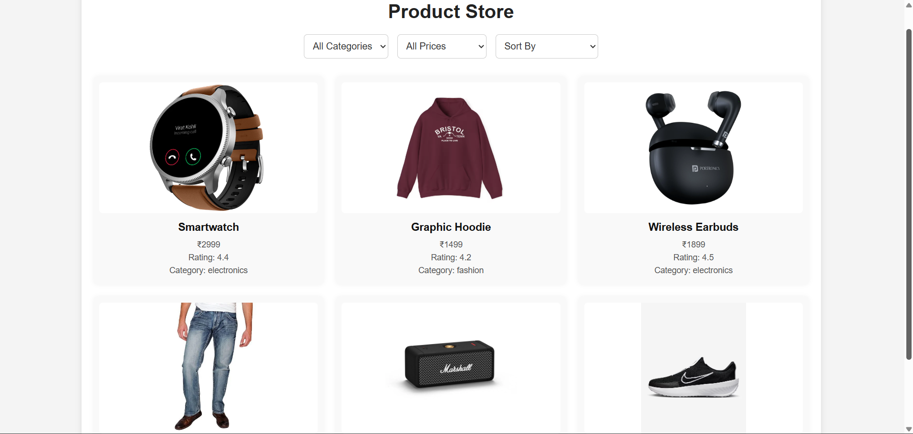
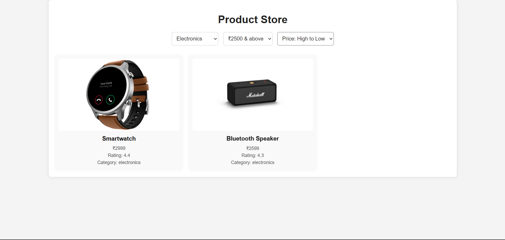

#  Product Listing Page with Filtering and Sorting

This project is a responsive and interactive **Product Listing Webpage** built using **HTML, CSS, and JavaScript**. It allows users to browse products, apply filters by category and price range, and sort items by price or rating.

---

## 📌 Features

- 🔎 Filter products by **category** (e.g., Electronics, Fashion, Books)
- 💰 Filter by **price range**
- ↕️ Sort products by **price (low-high, high-low)** or **rating**
- 🎨 Clean and colorful **UI design**
- 📱 Fully **responsive** grid layout (auto-fits on mobile, tablet, desktop)
- 🧠 Interactive interface powered by vanilla JavaScript

---

## 🖼️ Demo 

 https://yatheeswar42.github.io/Apex-task-4-productlist/

---

## 🚀 Technologies Used

- **HTML5** – Structure and layout
- **CSS3** – Responsive styling and colorful design
- **JavaScript (ES6)** – Dynamic filtering, sorting, and rendering logic

---

## 🛠️ Project Setup

To run this project locally:

1. Clone the repository:
   
   git clone https://github.com/your-username/product-listing-page.git

3. Navigate to the project folder:

   cd Apex task-4 productlist

5. Open index.html in your browser.

---

## 📷 Screenshots

---

